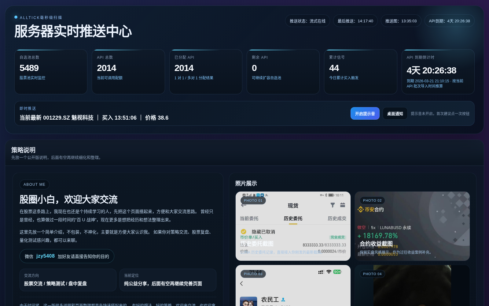
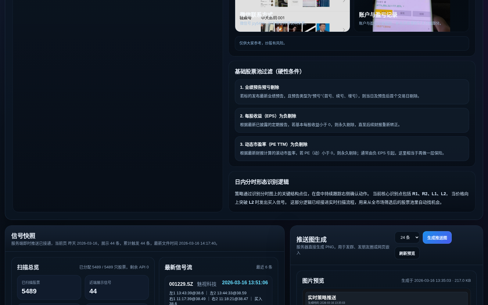
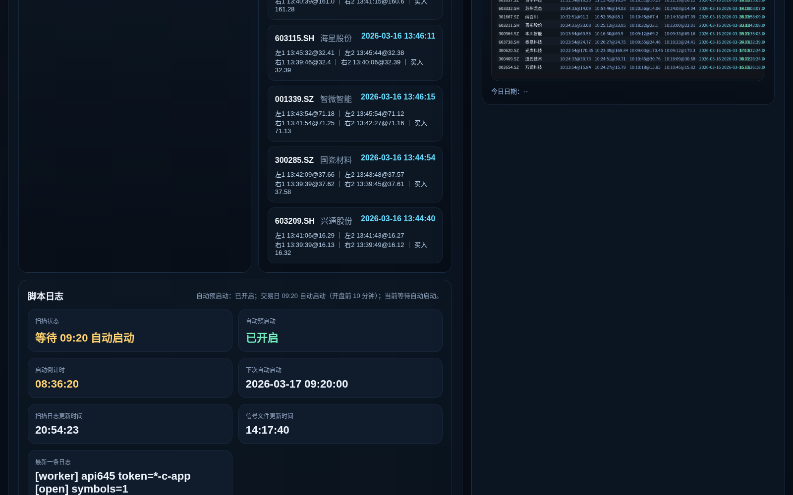

# Dreamle Stock Radar

`DreamleStockRadar` 是 `https://dreamle.vip/push` 的纯网页版源码仓库。  
本仓库聚焦 A 股实时扫描、信号展示和推送图生成，不再包含桌面端量化客户端代码。

## 项目简介

这是一个面向实盘盯盘场景的轻量 Web 工具，核心目标是：

- 把多 API 扫描结果实时汇总到一个网页面板
- 让信号、分配、日志和推送图可直接在浏览器查看
- 降低“看脚本日志 + 手动整理”成本，方便长期运行

如果你在做股票池筛选、盘中形态跟踪、信号回看，这个项目可以作为基础框架继续扩展。

## 在线地址

- 站点：`https://dreamle.vip/push`
- 仓库：`https://github.com/Jiangzy520/DreamleStockRadar`

## 核心功能

- AllTick 毫秒级扫描状态看板
- 实时信号流（左1 / 左2 / 右1 / 右2 / 确认买点）
- 推送图一键生成与预览
- API 分配与扫描日志可视化
- 页面内策略说明、风险提示与个人交流区

## 图片展示

<p>
  
</p>
<p>
  
</p>
<p>
  
</p>

## 项目结构

```text
webapp/
  server.py                 # Flask 入口
  templates/push.html       # 主页面
  static/                   # 前端资源（CSS/JS/图片）
tools/
  alltick_multi_token_seconds_live.py   # 实时扫描脚本
  generate_push_image.py                # 推送图生成
  watchlist_image_ocr.py                # 截图提取股票代码
start_guanlan_web.sh         # 启动 Web 服务
start_alltick_multi_token_seconds.sh
start_push_image_worker.sh
```

## 本地运行

1. 安装依赖

```bash
pip install -r requirements.txt
```

2. 启动 Web 服务

```bash
python webapp/server.py --host 0.0.0.0 --port 8768
```

3. 访问页面

```text
http://127.0.0.1:8768/push
```

## 运行数据目录

默认运行数据位于项目根目录 `.guanlan/`：

- `.guanlan/alltick_manager/watchlist.csv`
- `.guanlan/alltick_manager/apis.txt`
- `.guanlan/alltick_manager/stock_assignments.csv`
- `.guanlan/alltick/multi_token_variant_double_bottom_signals.csv`

请勿提交真实 API Token、账号密码或私有运行数据。

## 部署建议

- `nginx` 开启 `limit_req` + `limit_conn`，防止简单刷请求和爬虫
- 对 `/alltick/` 等后台路径启用 Basic Auth
- 配合 `systemd` 保证扫描脚本开机自启与异常重启
- 全站启用 HTTPS 与自动续期

## 免责声明

页面内容仅供参考，不构成投资建议。炒股有风险，入市需谨慎。

## License

MIT
